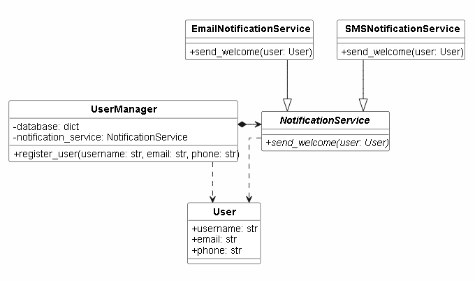

# Архитектурные принципы: High Cohesion (SRP) и Low Coupling (DIP)

## 1. Категория принципов

Концепции относятся к фундаментальным метрикам качества архитектуры ПО (SOLID/GRASP):

*   **High Cohesion (Высокая связность / SRP)** — каждый класс должен иметь одну обязанность и только одну причину для изменения.
*   **Low Coupling (Низкая связанность / DIP)** — модули должны быть максимально независимы. Высокоуровневый код не должен зависеть от деталей реализации; оба должны зависеть от абстракций.
---

## 2. Использование

*   **Гибкость:** замена инфраструктуры (БД, API) не затрагивает бизнес-логику.
*   **Тестируемость:** зависимости легко подменить Mock-заглушками.
*   **Читаемость:** код разделен на небольшие понятные компоненты.
*   **Повторное использование:** независимый и сфокусированный класс можно перенести в другой проект.
*   **Параллельная разработка:** программисты могут одновременно писать разные модули.
---

## 3. Ошибки при использовании (Антипаттерны)

*   **God Object (Божественный объект):** один класс делает всё (БД, логика, отправка писем).
*   **Hardcoding:** создание зависимостей через прямой вызов классов внутри конструктора.
*   **Эффект дробовика:** изменение одного модуля требует правок в десятке других мест.
*   **Невозможность изоляции:** код невозможно протестировать в отрыве от реальной среды
---

## 4. Графическое представление и участники



### Список участников (Правильная реализация)
1.  **`User`** — объект данных пользователя.
2.  **`NotificationService`** — абстрактный интерфейс для отправки уведомлений.
3.  **`EmailNotificationService` / `SMSNotificationService`** — конкретные реализации отправки.
4.  **`UserManager`** — компонент управления бизнес-логикой регистрации.

---

## 5. Формулировка задачи

**Контекст:** Реализуется регистрация пользователей с отправкой приветственного сообщения.
**Проблема:** Первичный код объединяет сохранение в БД и отправку email по SMTP в одном классе. Это нарушает SRP и жестко связывает компоненты.
**Задача:** Вынести отправку сообщений в отдельные классы и связать их с бизнес-логикой через абстрактный интерфейс.

---

## 6. Код решения

### Пример ОБРАТНОГО (Нарушение принципов)

```python
import dataclasses

@dataclasses.dataclass
class User:
    username: str
    email: str

class UserManager:
    """Low Cohesion и High Coupling: класс завязан на БД и SMTP одновременно."""
    def __init__(self):
        self.database = {}
        self.smtp_server = "://company.com"

    def register_user(self, username: str, email: str):
        # Обязанность 1: Работа с БД
        self.database[username] = User(username, email)
        print(f"[БД] Пользователь {username} сохранен.")

        # Обязанность 2: Сетевой протокол (Нарушение SRP и DIP)
        print(f"[SMTP] Подключение к {self.smtp_server}...")
        print(f"[SMTP] Email отправлен на {email}.")

if __name__ == "__main__":
    manager = UserManager()
    manager.register_user("alex", "alex@company.com")
```

---

### ПРАВИЛЬНАЯ РЕАЛИЗАЦИЯ (После рефакторинга)

```python
from abc import ABC, abstractmethod
import dataclasses

@dataclasses.dataclass
class User:
    username: str
    email: str
    phone: str = ""

# --- Абстракция (DIP) ---
class NotificationService(ABC):
    @abstractmethod
    def send_welcome(self, user: User): pass

# --- Реализации (High Cohesion) ---
class EmailNotificationService(NotificationService):
    def send_welcome(self, user: User):
        print(f"[Email] Письмо отправлено на {user.email}")

class SMSNotificationService(NotificationService):
    def send_welcome(self, user: User):
        print(f"[SMS] Сообщение отправлено на {user.phone}")

# --- Бизнес-логика (SRP / Low Coupling) ---
class UserManager:
    def __init__(self, notification_service: NotificationService):
        self.database = {}
        self.notification_service = notification_service # Внедрение зависимости

    def register_user(self, username: str, email: str, phone: str = ""):
        self.database[username] = User(username, email, phone)
        print(f"[БД] Пользователь {username} сохранен.")
        self.notification_service.send_welcome(self.database[username])

# --- Клиентский код ---
if __name__ == "__main__":
    # Сценарий 1: Через Email
    manager_email = UserManager(EmailNotificationService())
    manager_email.register_user("alex", "alex@company.com")

    # Сценарий 2: Переключение на SMS без изменения UserManager
    manager_sms = UserManager(SMSNotificationService())
    manager_sms.register_user("ivan", "ivan@company.com", phone="+79991112233")
```

---

## 7. Результат работы программы и выводы

### Вывод консоли:
```text
[БД] Пользователь alex сохранен.
[Email] Письмо отправлено на alex@company.com
[БД] Пользователь ivan сохранен.
[SMS] Сообщение отправлено на +79991112233
```

### Выводы:
1.  **SRP выполнен:** `UserManager` больше не отвечает за отправку сообщений.
2.  **DIP выполнен:** Логика регистрации зависит от интерфейса `NotificationService`, а не от конкретного способа связи, что позволяет легко добавлять новые каналы (Telegram, Push) без изменения старого кода.